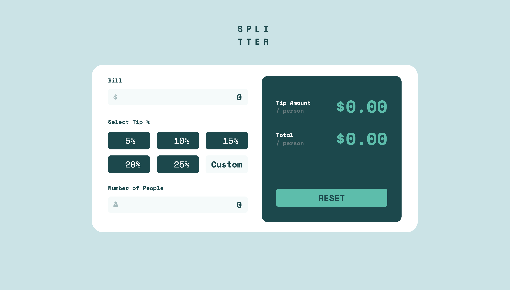
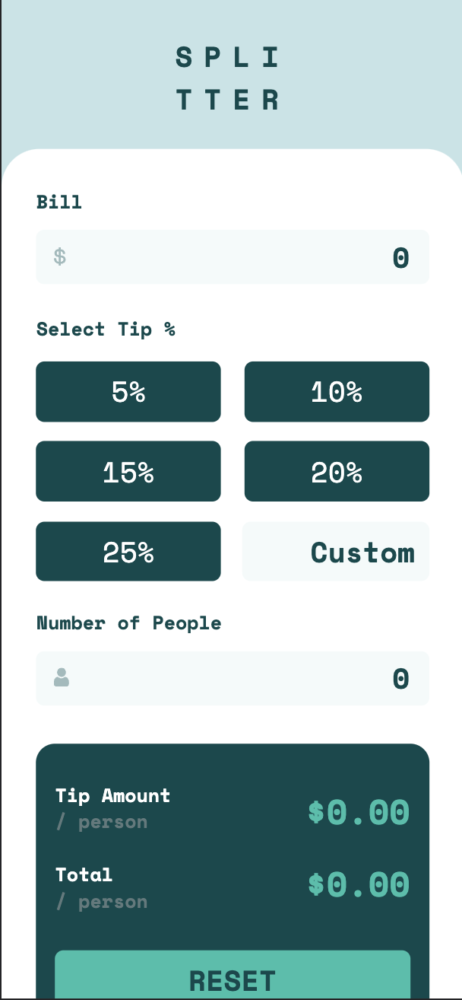

# Tip calculator
 
## Overview
----------
Tip calculator is a tool to calculate how much each person needs to pay when splitting a bill for eating out. This is a simple little project I did to practice CSS using SASS. While the code is all original and my own, the design for this app is not. I took the project idea from [frontendmentor.io](https://www.frontendmentor.io/challenges/tip-calculator-app-ugJNGbJUX).
 
While this app was designed with a mobile first approach and will respond to tablet sized screens, it looks best on bigger or smaller screens. This is partly due to there being no medium screen mockups for the project as well as my own opinion that it would rarely be used on tablet sized screens.
 
 
### Screenshots
------------------
 
Desktop (Screens 920px wide and larger)
 

 
Mobile
 

 
 
### Links
 
- Live Site URL: [https://zio-4.github.io/tip-calculator/](https://zio-4.github.io/tip-calculator/)
 
### My process
-----------
 
I built this app with a mobile first workflow. This is because I felt the app was most likely going to be used on mobile devices.
 
### Built with
 
- Semantic HTML5 markup
- CSS
- Flexbox
- SASS
- Mobile-first workflow
- React
 
 
### What I learned
-------------
 
CSS:
- Flexbox: I learned how to use flexbox for a responsive layout. This included how to make columns and align elements properly.
- Units: I learned how and when to use em and rem
- Became more familiar with padding and margins

Javascript:
- I learned that I can use the double bang to check for non empty strings (including " " and "0")
```js
!!billValue
```
- I learned about the toFixed method which caps numbers after the decimal to whatever number you pass in (from 0 to 20) and turns the number to a string. I also learned about using the + operator as a shorthand to convert a string to a number
```js
const tipDivided = +((tip / peopleInNumber).toFixed(2))
```
 
 
### Useful resources
--------
 
- [Conquering responsive layouts](https://courses.kevinpowell.co/conquering-responsive-layouts) - This helped me in learning responsive design and covered things like flexbox. I really liked how the course is spaced out and easy to follow.
- [Flexbox Zombies](https://mastery.games/flexboxzombies/) - One of the coolest coding resources i've found so far. This is a game designed to help you learn CSS flexbox while getting to kill zombies :).